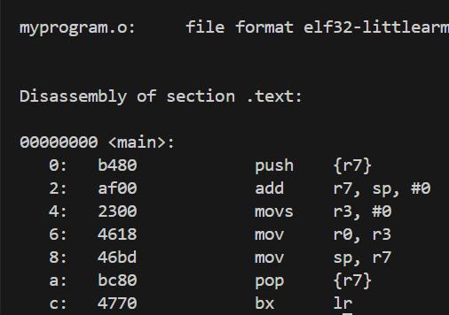
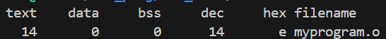
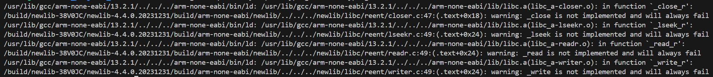
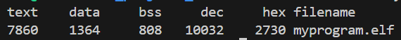

# arm_boot
Basic implementation for a boot sequence for ARM microcontroller from scratch.

## Command to compile the file "myprogram.c"

arm-none-eabi-gcc -mcpu=cortex-m4 -mthumb -std=c11 -g -O0 -c myprogram.c -o myprogram.o

Sections:
* .text: the code(instructions)
* .data: initialized variables (Flash section that then its copy to RAM at runtime)
* .bss unitialized variables (zero - RAM section)
* .rodata constants